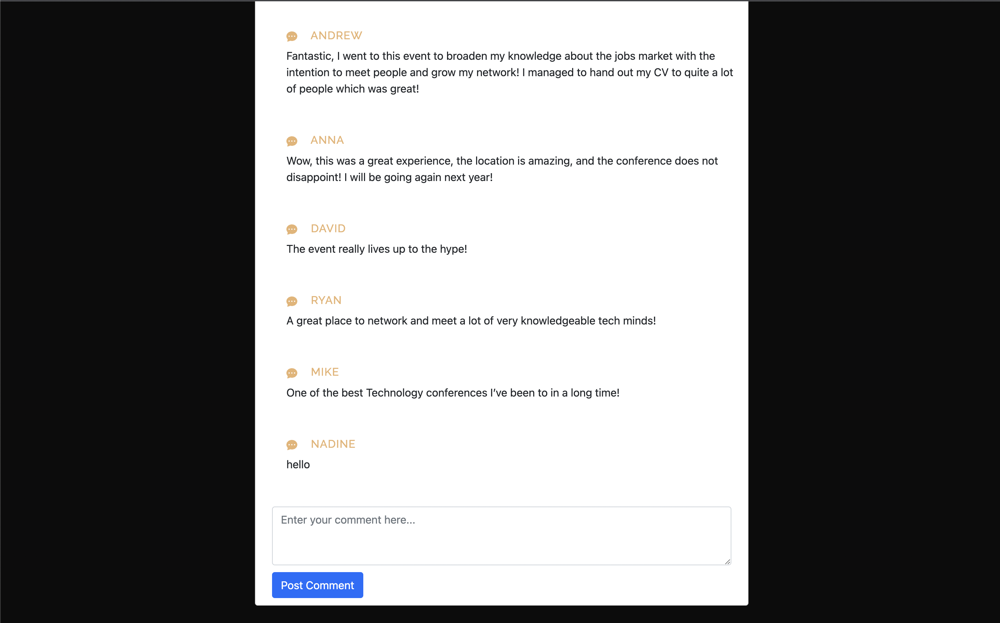

# EvenTech

## Table of contents

- [Description](#description)
- [Installation](#installation)
- [Usage](#usage)
- [Technologies and Languages](#technologies-and-languages)
- [Contributing](#contributing)
- [Tests](#tests)
- [License](#license)
- [Screenshot](#screenshot)
- [Deployed application](#deployed-application)
- [GitHub repository](#github-repository)
- [Questions](#questions)

---

## Description

As a team we have been tasked to conceive and execute a design that solves a real-world problem. In creating our first collaborative MERN stack single-page application, we have combined a scalable MongoDB back end, a GraphQL API, and an Express.js and Node.js server with a React front end, implementing user authentication with JWT to build a user-focused platform. We’ll continue to build on the agile development methodologies we’ve used throughout this course. These include storing our project code in GitHub, managing our work with a project management tool, and implementing feature and bug fixes using the Git branch workflow and pull requests.

---

## Installation

Start with cloning this repository link on to your local machine:

```
$ git clone https://github.com/riz1ash786/eventech
$ cd eventech
```

To install the required dependencies and set up the application, run:

```
$ npm i
$ npm run seed
$ npm run develop
```

---

## Usage

Enter `npm run develop` in terminal to start the application. Once a port has been presented in terminal then type `localhost:3000` into browser to display the application locally and to access apollo server use `localhost:3001/graphql`. Alternatively, if you wish to deploy this application on Heroku then please use the link provided in the 'Deployed Application' section listed below.

---

## Technologies and Languages

<div>
&nbsp;
&nbsp;
&nbsp;
&nbsp;
&nbsp;
&nbsp;
&nbsp;
&nbsp;
&nbsp;
&nbsp;
&nbsp;
&nbsp;

</div>

---

[](https://github.com/riz1ash786/github-readme-stats)

## Contributing

<div id="badges">
  <a href="https://github.com/NadineMohsen">
    
  </a> <br />
  <a href="https://github.com/riz1ash786">
    
  </a> <br />
  <a href="https://github.com/JosephCurtis1999">
    
  </a>
</div>

---

## Tests

No tests have been specified for this application as of yet.

---

## License

 <br />
This application utilises the [ISC License](https://opensource.org/licenses/ISC "License Link")

---

## Screenshot





---

## Deployed Application

<div id="badges">
  <a href="https://eventech-app.herokuapp.com/">
    
  </a>
</div>

---

## GitHub Repository

<div id="badges">
  <a href="https://github.com/riz1ash786/eventech">
    
  </a>
</div>

---

## Questions

If you have any additional questions, then please feel free to get in touch via our email details linked below. Thank you.

<div id="badges">
  <a href="mailto:riz1ash786@gmail.com">
    
  </a> <br />
  <a href="mailto:Nadine.mohsen@hotmail.com">
    
  </a> <br />
  <a href="mailto:joecurtis9999@gmail.com">
    
  </a>
</div>
